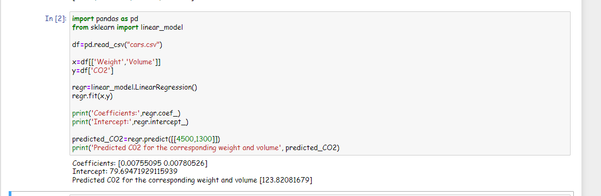

# Implementation of Multivariate Linear Regression
## Aim
To write a python program to implement multivariate linear regression and predict the output.
## Equipment’s required:
1.	Hardware – PCs
2.	Anaconda – Python 3.7 Installation / Moodle-Code Runner
## Algorithm:
### Step1
import pandas as pd

### Step2
Then Import sklearn from Linear model

### Step3
<br>Then open the csv file with pd.read_csv()

### Step4
<br>And mention the coefficients as X and also mention y-intercept as Y

### Step5
<br>use Linearregression of coefficient and intercept.then predict the needed values.

## Program:
```
#DEVELOPD BY : NAVEENKUMAR.S
#ROLL_NO: 212221240033
import pandas as pd
from sklearn import linear_model

df=pd.read_csv("cars.csv")

x=df[['Weight','Volume']]
y=df['CO2']

regr=linear_model.LinearRegression()
regr.fit(x,y)
    
print('Coefficients:',regr.coef_)    
print('Intercept:',regr.intercept_)    
    
predicted_CO2=regr.predict([[4500,1300]])    
print('Predicted C02 for the corresponding weight and volume', predicted_CO2)


```
## Output:

### Insert your output



## Result
Thus the multivariate linear regression is implemented and predicted the output using python program.